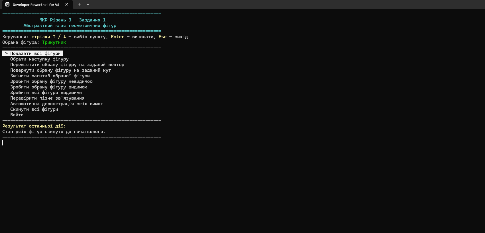
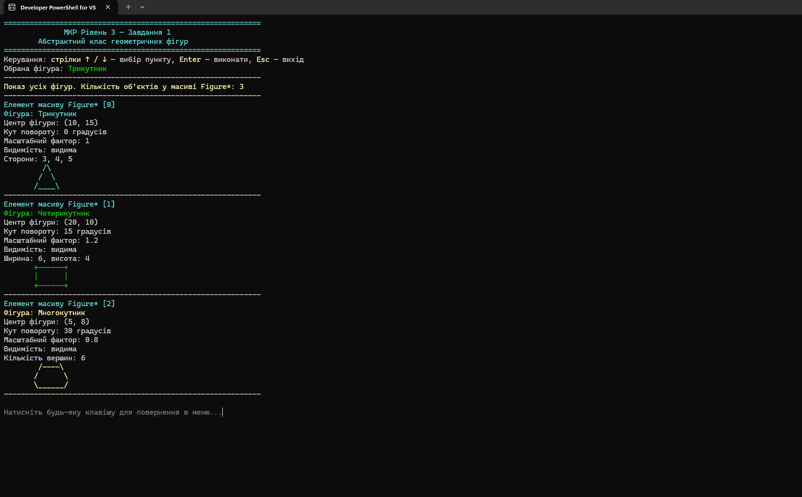
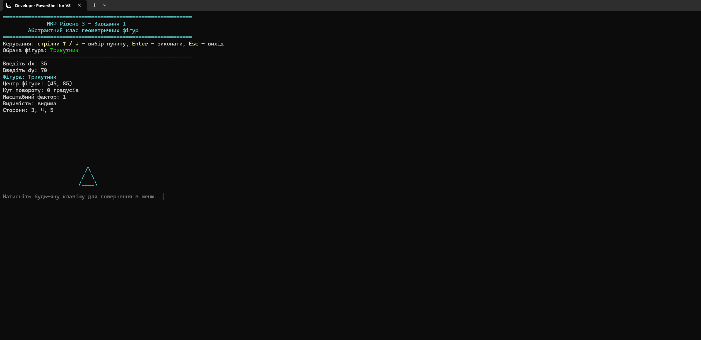
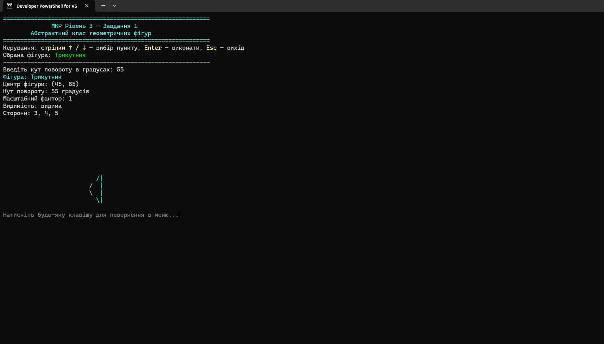
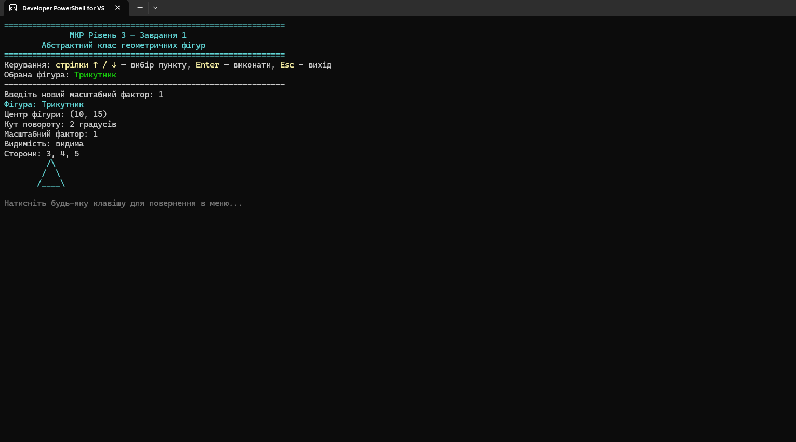
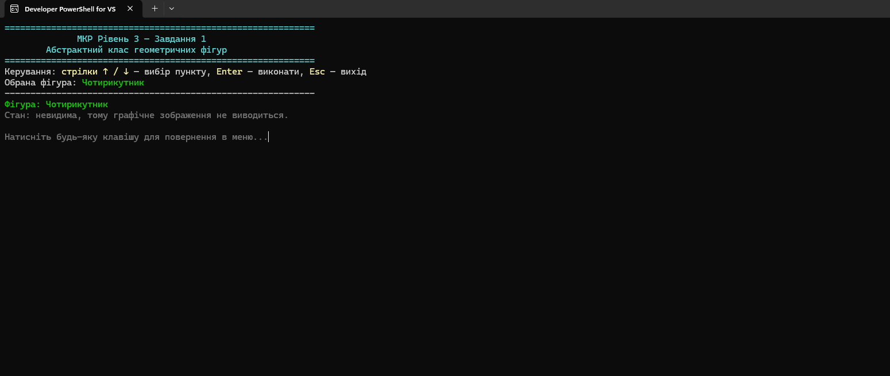
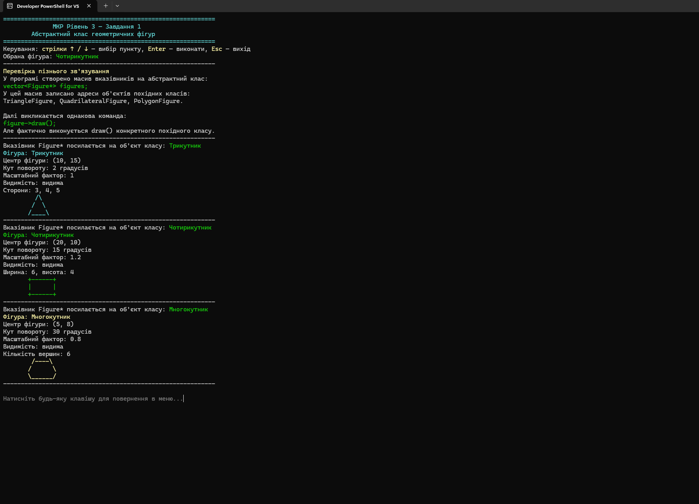

# Завдання 1. Абстрактний клас геометричних фігур

## Опис завдання

У цьому завданні реалізовано програму на C++ для роботи з геометричними фігурами через абстрактний базовий клас.

Програма демонструє:
- створення абстрактного класу `Figure`;
- використання похідних класів для різних фігур;
- роботу з масивом вказівників на абстрактний клас;
- пізнє зв’язування через віртуальні методи;
- переміщення, поворот, масштабування та зміну видимості фігур.

## Основний файл програми

- [01_geometric_figures_app.cpp](./01_geometric_figures_app.cpp)

## Реалізовані можливості

- показ усіх фігур;
- вибір поточної фігури;
- переміщення фігури на заданий вектор;
- поворот фігури на заданий кут;
- зміна масштабу;
- приховування та відображення фігури;
- скидання фігур до початкового стану;
- демонстрація пізнього зв’язування.

## Скріншоти виконання

### Головне меню програми



### Показ усіх фігур



### Переміщення фігури



### Поворот фігури



### Масштабування фігури



### Зміна видимості фігури



### Перевірка пізнього зв’язування



## Компіляція

Приклад команди для компіляції у Developer PowerShell for Visual Studio:

```powershell
cl /EHsc /utf-8 01_geometric_figures_app.cpp
