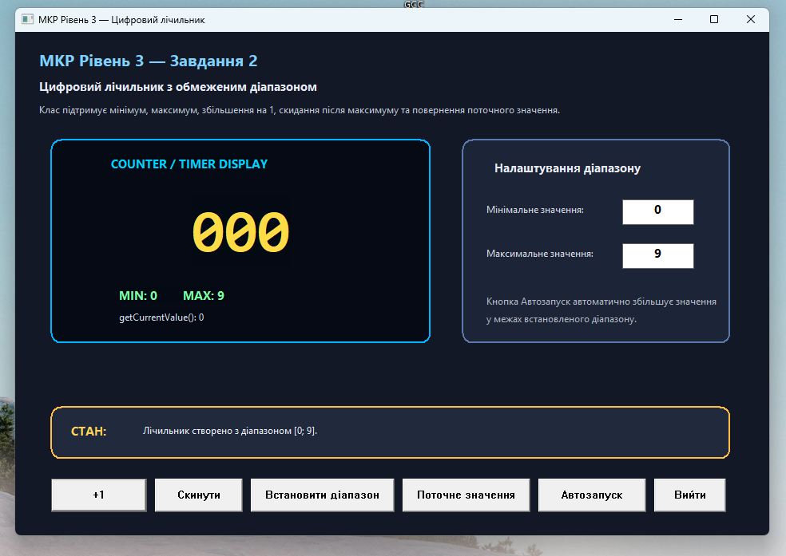
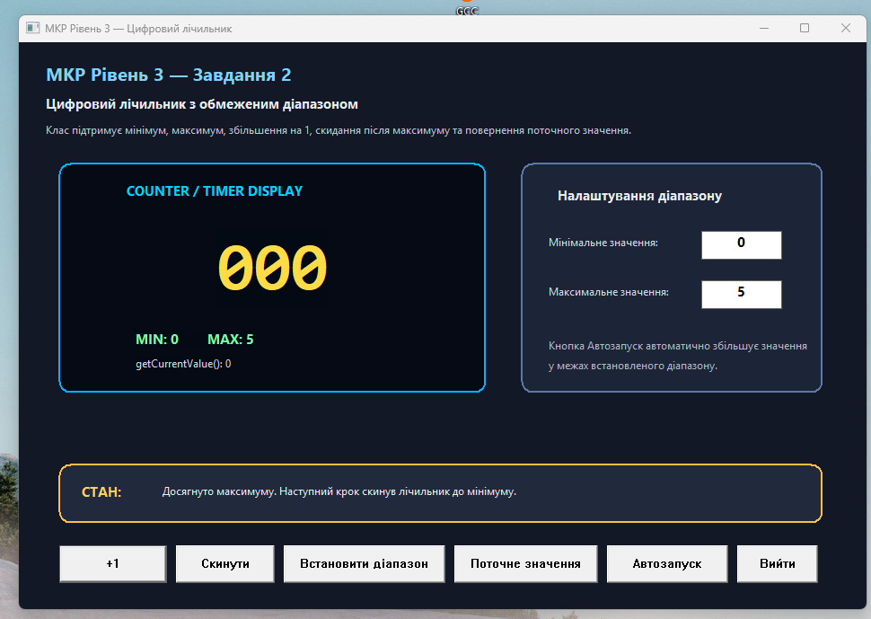
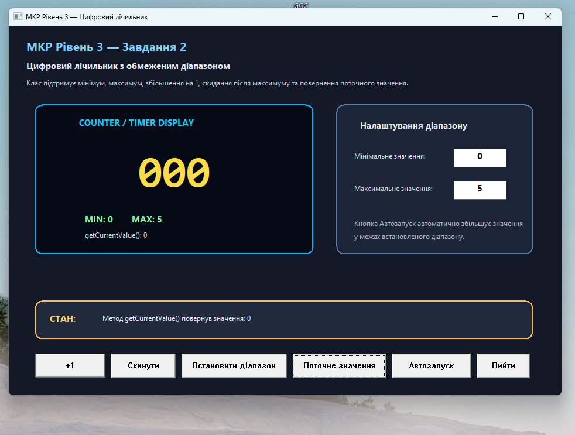

# Завдання 2. Цифровий лічильник

## Опис завдання

У цьому завданні реалізовано клас цифрового лічильника з обмеженим діапазоном значень.

Цифровий лічильник — це змінна з мінімальним і максимальним значенням. Після досягнення максимального значення наступне збільшення скидає лічильник до мінімального значення.

Програма демонструє:
- створення класу `DigitalCounter`;
- встановлення мінімального та максимального значення;
- збільшення значення лічильника на 1;
- автоматичне скидання після досягнення максимуму;
- повернення поточного значення;
- графічний інтерфейс у вигляді таймера/лічильника.

## Основний файл програми

- [02_digital_counter_gui.cpp](./02_digital_counter_gui.cpp)

## Реалізовані можливості

- створення цифрового лічильника з початковим діапазоном;
- встановлення нового діапазону мінімального і максимального значень;
- збільшення поточного значення на 1;
- скидання лічильника до мінімального значення;
- автоматичне повернення до мінімуму після досягнення максимуму;
- отримання поточного значення через метод `getCurrentValue()`;
- візуальне відображення значення у графічному інтерфейсі.

## Скріншоти виконання

### Стартове вікно цифрового лічильника



### Встановлення діапазону


### Збільшення значення лічильника


### Автоматичне скидання після максимуму



### Отримання поточного значення



## Ключова ідея реалізації

Основна логіка програми зосереджена в класі `DigitalCounter`. Клас зберігає мінімальне, максимальне та поточне значення лічильника. Метод `increment()` збільшує значення на 1, а якщо досягнуто максимуму — повертає лічильник до мінімального значення.

```cpp
class DigitalCounter {
private:
    int minValue;
    int maxValue;
    int currentValue;

public:
    DigitalCounter(int minValue, int maxValue) {
        this->minValue = minValue;
        this->maxValue = maxValue;
        this->currentValue = minValue;
    }

    void setRange(int minValue, int maxValue) {
        this->minValue = minValue;
        this->maxValue = maxValue;
        this->currentValue = minValue;
    }

    void increment() {
        if (currentValue >= maxValue) {
            currentValue = minValue;
        } else {
            currentValue++;
        }
    }

    void reset() {
        currentValue = minValue;
    }

    int getCurrentValue() const {
        return currentValue;
    }
};
