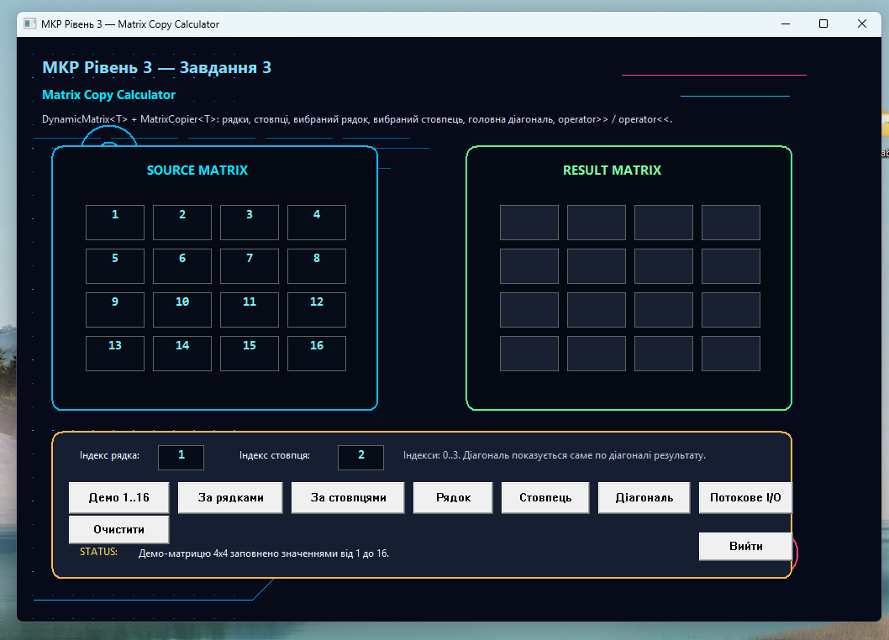
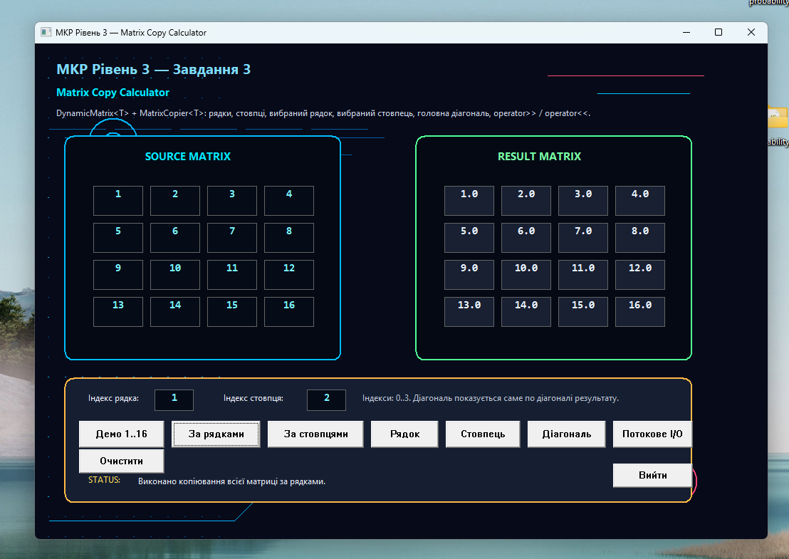
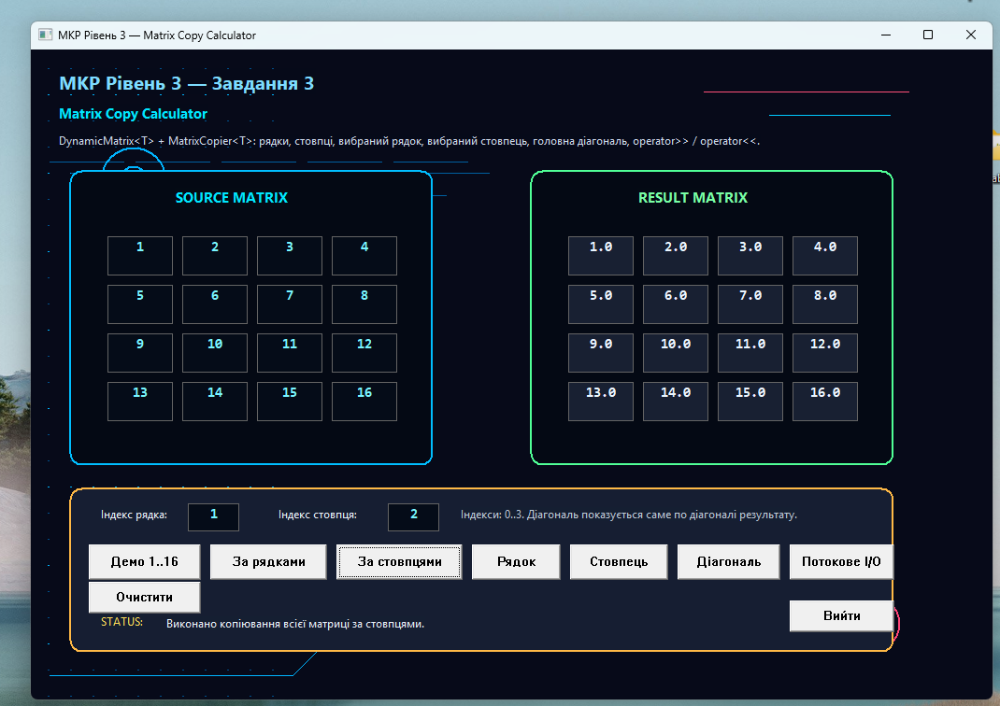
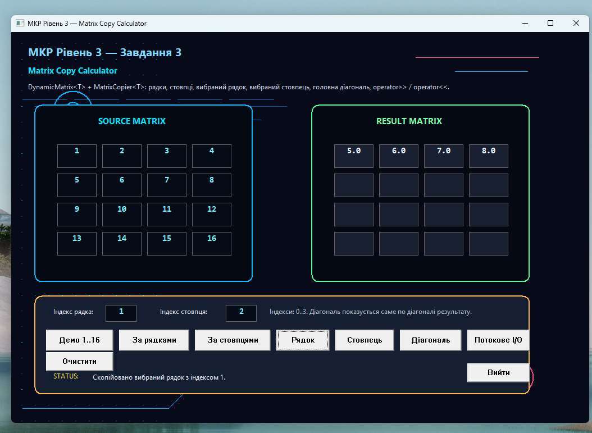
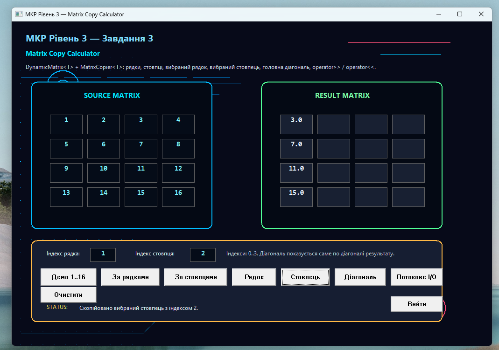
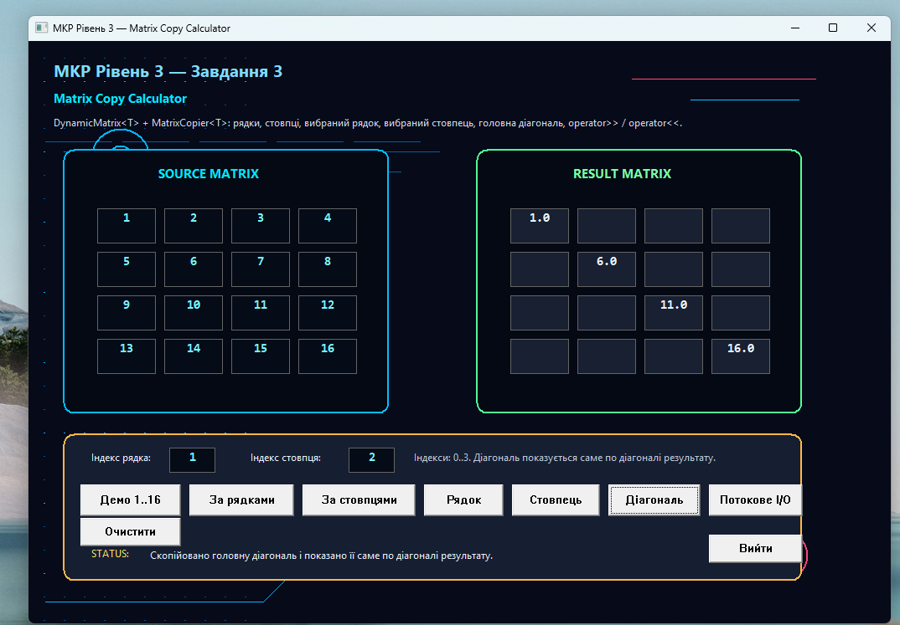
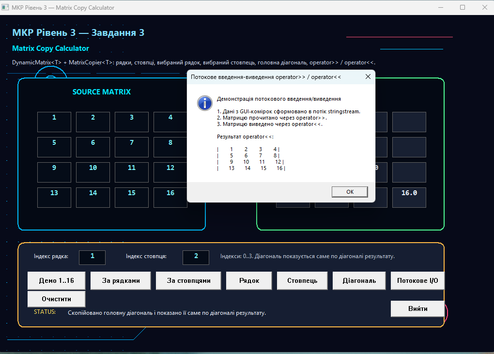

# Завдання 3. Шаблонний клас копіювання двовимірного масиву

## Опис завдання

У цьому завданні реалізовано шаблонний клас для роботи з двовимірним динамічним масивом довільного типу.

Програма демонструє:
- створення шаблонного класу `DynamicMatrix<T>`;
- роботу з двовимірним динамічним масивом;
- копіювання матриці за рядками;
- копіювання матриці за стовпцями;
- копіювання вибраного рядка;
- копіювання вибраного стовпця;
- копіювання головної діагоналі;
- потокове введення та виведення через оператори `>>` і `<<`;
- графічний інтерфейс для наочного виконання операцій.

## Основний файл програми

- [03_template_matrix_calculator_gui.cpp](./03_template_matrix_calculator_gui.cpp)

## Реалізовані можливості

- створення матриці 4x4 з демонстраційними значеннями;
- копіювання всієї матриці за рядками;
- копіювання всієї матриці за стовпцями;
- копіювання вибраного рядка за індексом;
- копіювання вибраного стовпця за індексом;
- копіювання головної діагоналі;
- очищення результату;
- демонстрація потокового введення-виведення.

## Скріншоти виконання

### Стартове вікно Matrix Copy Calculator



### Копіювання за рядками



### Копіювання за стовпцями



### Копіювання вибраного рядка



### Копіювання вибраного стовпця



### Копіювання головної діагоналі



### Потокове введення-виведення



## Ключова ідея реалізації

Основна логіка програми побудована на шаблонному класі `DynamicMatrix<T>`, який дозволяє створювати матриці довільного типу. Для копіювання використано окремий клас `MatrixCopier<T>`.

```cpp
template <typename T>
class DynamicMatrix {
private:
    int rows;
    int cols;
    T** data;

public:
    DynamicMatrix(int rowCount, int colCount);
    DynamicMatrix(const DynamicMatrix<T>& other);
    DynamicMatrix<T>& operator=(const DynamicMatrix<T>& other);
    ~DynamicMatrix();

    T* operator[](int row);
    const T* operator[](int row) const;

    int getRows() const;
    int getCols() const;
};
