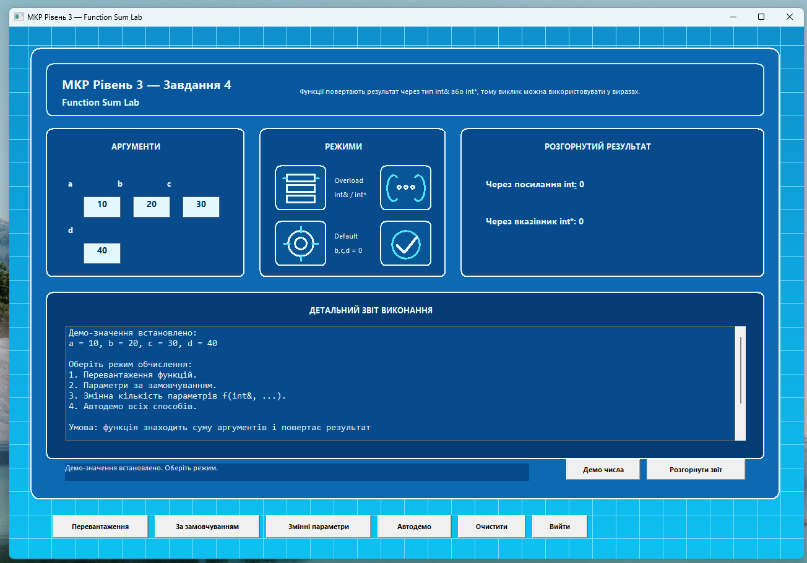
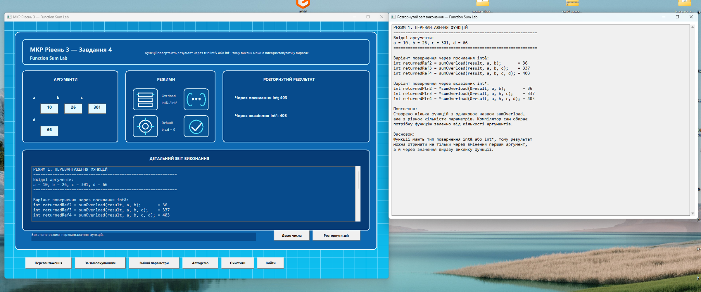
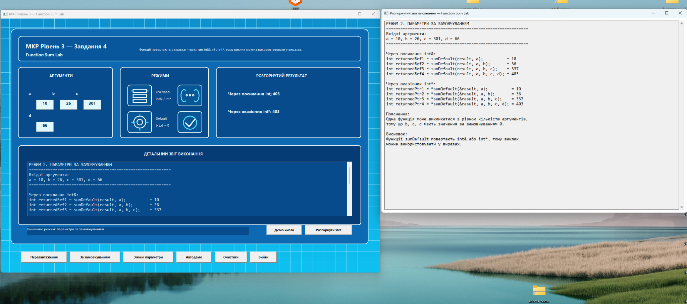
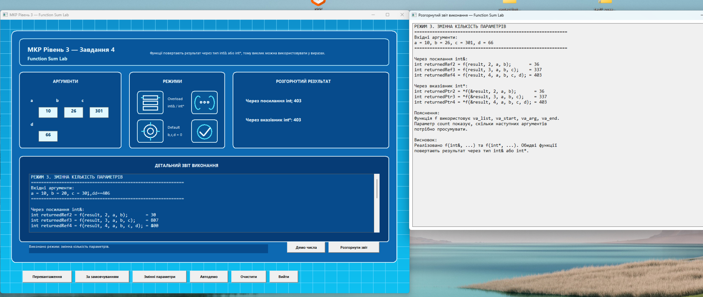
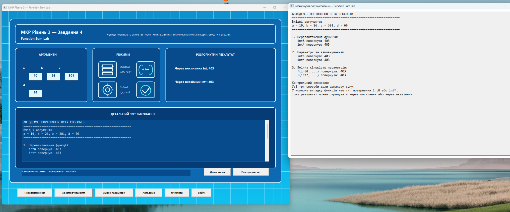

# Завдання 4. Функції з різною кількістю аргументів

## Опис завдання

У цьому завданні реалізовано програму з використанням функцій, які знаходять суму своїх аргументів і повертають результат через перший аргумент.

За умовою потрібно реалізувати варіанти функцій, які дозволяють звернення з різною кількістю аргументів:

- перевантаження функцій;
- функція з параметрами за замовчуванням;
- функція зі змінною кількістю параметрів `f(int&, ...)`;
- повернення результату через посилання;
- повернення результату через вказівник.

У програмі функції мають тип повернення `int&` або `int*`, тому результат можна отримувати безпосередньо через виклик функції у виразі.

## Основний файл програми

- [04_function_sum_lab_gui.cpp](./04_function_sum_lab_gui.cpp)

## Реалізовані можливості

- обчислення суми для різної кількості аргументів;
- повернення результату через посилання `int&`;
- повернення результату через вказівник `int*`;
- перевантаження функцій `sumOverload`;
- функції з параметрами за замовчуванням `sumDefault`;
- функції зі змінною кількістю параметрів `f(int&, ...)` та `f(int*, ...)`;
- автоматична демонстрація всіх способів;
- графічний інтерфейс для наочного перегляду результатів.

## Скріншоти виконання

### Стартове вікно програми



### Перевантаження функцій



### Функція з параметрами за замовчуванням



### Функція зі змінною кількістю параметрів



### Автоматична демонстрація всіх способів



## Ключова ідея реалізації

У програмі реалізовано три різні підходи до виклику функцій з різною кількістю аргументів.

### 1. Перевантаження функцій

```cpp
int& sumOverload(int& result, int a, int b) {
    result = a + b;
    return result;
}

int& sumOverload(int& result, int a, int b, int c) {
    result = a + b + c;
    return result;
}

int& sumOverload(int& result, int a, int b, int c, int d) {
    result = a + b + c + d;
    return result;
}

int* sumOverload(int* result, int a, int b, int c, int d) {
    if (result != nullptr) {
        *result = a + b + c + d;
    }

    return result;
}
